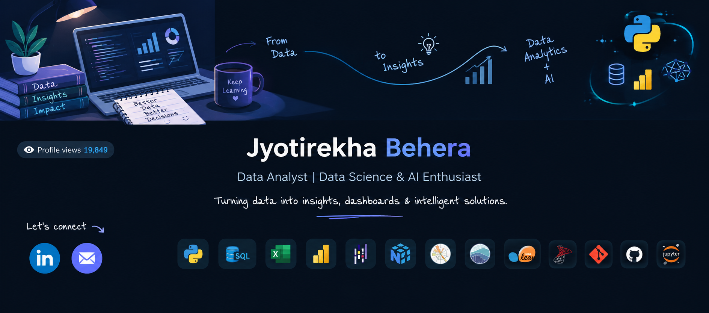

# 👋 Hi, I'm Jyotirekha Behera

### 📊 Aspiring Data Scientist | Data Analyst | Python • SQL • Power BI

Curious about data, passionate about finding patterns, building analytical solutions,
and turning raw data into meaningful insights. Currently learning, building,
and looking for opportunities to grow in Data Science & Analytics.

---

### 💡 A little about me

* 🔍 Interested in **Data Science, Data Analytics & AI**
* 🐍 Working with **Python, SQL, Excel & Power BI**
* 🤖 Exploring **Machine Learning & NLP**
* 📊 Building projects using real-world datasets
* 🌱 Always learning and improving my skills through practical projects

### 🤝 Connect with me

---

### 🛠️ Skills

